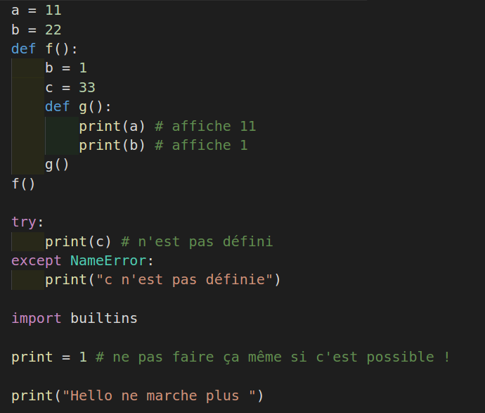
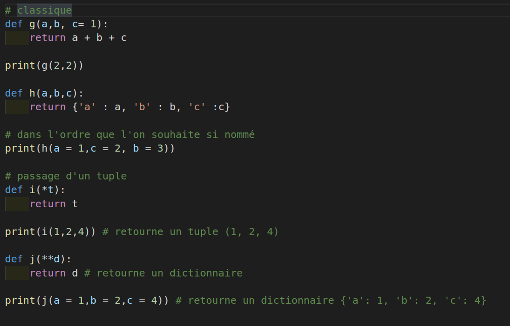

# Introduction Python

Python est langage objet multi-paradigme. Il est doté d'un typage dynamique fort. C'est un langage libre. 
Ce langage peut s'adapter à tout type de contexte grâce à de nombreux modules (extensions). 
Il est très répendu dans le monde scientifique et notamment dans le calcul numérique. 
Ce langage a été conçu par Guido van Rossum (Pays-Bas). Le début de ce langage commence pendant des vacances de Noël où le concepteur 
décide de travailler à sa création, fan des Monty Python il décide de baptiser son langage Python. 
Le langage  utilise l'indentation comme syntaxe.

Pour toutes les règles de Python qu'il faut suivre vous pouvez importer dans la console le module this :

```python
import this
```

Une règle de Python que nous suivrons dans le cours par exemple c'est : "Il vaut mieux être explicite qu'implicte".

## Installation
![Installation]{https://www.python.org/downloads/
Installer également Ipython à l'aide de pip, équivalent de npm
Utilisez Visual Studio Code 
Dans VS installez les modules suivants : Python Extension Pack Don Jayamanne
Ainsi que Python ms-python-python 

## LEGB
Nous allons préciser tout de suite une notion fondamentale sur le mécanisme de portée de variable en Python.
										
- L pour localement, Python regarde si vous avez défini la variable localement.
- E pour englobante, Python regarde si la variable n'est pas définie dans la première fonction englobante puis remonte ...
- G pour globalement, Python va alors chercher la variable de manière globale.

- B pour Builtins, Python regarde alors dans le module Builtins.

## Exemple LEGB


Passage d'arguments à une fonction
Python offre 4 méthodes pour passer des arguments à une fonction, voyez les exemples qui suivent :


## Quelques définitions de base

Python utilise l'indentation comme syntaxe.

- Définition d'une fonction

```python
def myFunction(a, b):
	print(a + b)
```

- Les condtions

```python
if True :
	print("Bonjour tout le monde")
else: 
	print("Aurevoir tout le monde")
```

Un exemple avec if elif (il else if)

```python
a = 5
if a > 5:
	a = a + 1
elif a == 5:
    a = a + 1000
else:
    a = a - 1
```

- Valeurs booleans :

```python
True
False
```

- La structure d'une boulce en Python

```python
 # Boucle de 1 à 9
for x in range(1, 10):
	print(x)

# Boucle de 0 à 9
for x in range(10):
	print(x)
```

- Boucle tant que

```python
count = 0
while True:
	count += 1
	if count > 100:
		break
```

## Structure de données

En Python une grande force du langage c'est les structures de données. Elles permettent 
de manipuler les données avec beaucoup d'intelligence et d'optimisation. 
Python est un langage adapté au Big Data par exemple, notamment pour sa grande richesse au 
niveau des structures de données.

### Définition d'une liste

Une liste est une suite de valeurs séparées par une virgule et placées entre crochets : 

```python
l = [1,2,3,4,5]
l[0] # 1
l[-1] # 5

# Slicing
l[-2:]
```
### l'opérateur : sur les listes

```python
l = [1,2,3,4,5]

l[1:-1] # retourne [2,3,4]

l[:2] # retourne [1,2] s'arrête à l'indice 2

# l[start:end:step]
l[::2] # [1,3,5] début fin par pas de 2 
```
	
## Les listes et quelques méthodes

```python
l = []
l.append(10) # ajouter 10 à la liste

# Ajoute tous les éléments d'un itérables
l.extend( x*x for x in range(10))
# [0, 1, 4, 9, 16, 25, 36, 49, 64, 81]

# insérer un élément à une position donnée, ici indice 2 on insère 100
l.insert(2, 100)
# [0, 1, 100, 4, 9, 16, 25, 36, 49, 64, 81]

# pop retirer un élément à l'indice 2 
l.pop(2)
# [0, 1, 4, 9, 16, 25, 36, 49, 64, 81]

# pop retire le dernier élément de la liste
l.pop() 
# [0, 1, 4, 9, 16, 25, 36, 49, 64]

# renvoie l'indice du premier élément trouvé ici 2
l.index(4)

# compte le nombre d'élément 2 dans une liste
l.count(2)

# longueur de la liste
len(l)

# tri une liste par ordre croissant par référence
l.sort()

# ordre décroissant par référence
l.sort(reverse=True)

# Supprime tous les éléments d'une liste
l.clear()
```

Une liste n'est pas copiée elle a une même référence
Si vous copiez une liste dans une autre variable celle-ci sera référencée vers la même liste, elle n'est pas copiée.

```python
l = [1,2,3,4,5]
m =l
m[0] = 100
print(l, m) # [100, 2, 3, 4, 5] [100, 2, 3, 4, 5]
```

On notera également que les listes et les chaînes de caractères en Python ont des nombreuses propriétés en commun.

## Faire une shallow copy pour copier la liste

Il faut faire ce que l'on appelle une shallow copy pour copier une nouvelle liste dans une nouvelle variable.

```python
q = l[:]
```

Remarque sur la copie peu profonde (shallow copy)

```python
# il y a 4 références ici 
r = [[1, 2], [3, 4], [5, 6]]

# shallow copy ne fait la copie que de la première 
t = r[:]
t[0][0] = 100

print(r, t)
# [[100, 2], [3, 4], [5, 6]] [[100, 2], [3, 4], [5, 6]]
```

### 01 Exercice maximun d'une liste avec indice

Ecrire une fonction qui permet de retourner le maximun d'une liste de nombres avec son indice. Vous devez utiliser uniquement les deux fonction **builtins** suivantes de Python : len et index.

Vous pouvez vérifiez la cohérence de votre programme en vérifiant le type et que la liste n'est pas vide.

Un assert permet de lever une exception si elle est fausse
```python
assert type(l) == list and len(l) > 0
```

Vous pouvez également utiliser un module standard Python pour mélanger votre liste, nous reverrons la notion de module dans le cours. 

```python
import random as r
l = [0, 1, 100, 4, 9, 16, 25, 36, 49, 64, 81]   

# Cette fonction mélangera les éléments
r.shuffle(l)
```

### 02 Exercice lettre en majuscule

Ecrire une fonction qui permet de vérifier qu'une liste de caractères ne contient que des majuscules.

```python
testUpper(['A', 'B', 'C' , 'D']) # True
```

Utilisez la méthode all de Python sur une liste :

```python
l = [True, True, True]
# Si tous les élément sont True alors all retourne True dans le cas contraite False
res = all(l)
print(res) # True
```

### 03 Exercice multiplication

Ecrire une fonction qui prend deux listes de nombres de même longueur et multiplie les éléments de la liste terme à terme en faisant leur somme.

## Compréhension de liste

Elles permettent la construction de liste de manière concise. Ci-dessous construction d'une liste des cubes de 1 à 10 :

```python
cubes = [ x**3 for x range (1, 11)]
```

### Compréhension de liste avec un tuple

Ci-dessous on utilise un tuple, une structure de données que l'on précisera plus tard :

```python
print( [ (a,b) for a in range(1, 4) for b in range(4, 11)] )

"""
[(1, 4), (1, 5), (1, 6), (1, 7), (1, 8), (1, 9), (1, 10), (2, 4), (2, 5), (2, 6), (2, 7), (2, 8), (2, 9), (2, 10), (3, 4), (3, 5), (3, 6), (3, 7), (3, 8), (3, 9), (3, 10)]
"""
```

Cette compréhension de liste est équivalente à l'écriture suivante :

```python
l = []
for a in range(1, 4):
	for b in range(4, 11):
		l.append((a, b))

"""
[(1, 4), (1, 5), (1, 6), (1, 7), (1, 8), (1, 9), (1, 10), (2, 4), (2, 5), (2, 6), (2, 7), (2, 8), (2, 9), (2, 10), (3, 4), (3, 5), (3, 6), (3, 7), (3, 8), (3, 9), (3, 10)]
"""
```

Vous pouvez également ajouter une condition à une compréhension de liste.

```python
print( [ (a,b) for a in range(1, 4) for b in range(4, 11) if a + b < 8 ] )

"""
[(1, 4), (1, 5), (1, 6), (2, 4), (2, 5), (3, 4)]
"""
```

De manière équivalente

```python
l = []
for a in range(1, 4):
	for b in range(4, 11):
		if a + b < 8:
			l.append((a, b))

"""
[(1, 4), (1, 5), (1, 6), (2, 4), (2, 5), (3, 4)]
"""
```

### 04 Exercice multiplication avec tuple

Ecrire une fonction qui prend deux tuples de nombres de même longueur et multiplie les éléments du tuple terme à terme en faisant leur somme.

Un tuple se parcourt comme une liste.

```python
t1 = (1,2,3)
for e in t1:
	print(e)
#1 2 3
```
  
### 05 Exercice Transposer une matrice

Dans cet exercice vous pouvez essayer d'utiliser les compréhensions de liste.

Soit la matrice suivante : transposez celle-ci, c'est-à-dire transformez les lignes en colonnes à l'aide d'une compréhension de liste :
	
```python
matrix = [
	[1,2,3],
	[4,5,6],
	[7,8,9]
]
```

Nous aimerions obtenir :

```python
transposed = [
	[1,4,7],
	[2,5,8],
	[3,6,9]
]
```
