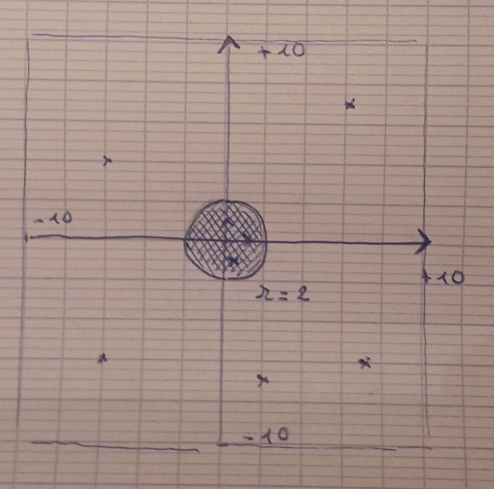

# Probabilité

Créez une classe Circle pour faire cette étude.

Soit un cercle de rayon r = 2 inscrit dans un carré de dimension 20 X 20 parfaitement au milieu. Importer le module random et math dans votre script. Tirez au hasard une flèche dans ce carré, on supposera que toutes les flèches tombent dans le carré. Donc impacte le carré de manière équiprobable sur sa surface.
Comptez le nombre de fois que vous atteignez la cible en simulant l'expérience de tir avec N = 1000 lancers ou tirs. 
  
1. Expérience : Faites un ratio des nombres d'impacts dans le cercle de rayon r = 2 par rapport aux nombres de tires totaux, que pouvez-vous en dire sur la chance d'atteindre la cible, donnez une estimation lisible de celle-ci ?

2. étudiez par rapport à la valeur théorique de la probabilité et la valeur **empirique** (c'est la question 1 par l'expérience). Nous vous rappelons cette valeur théorique compte tenu des conditions de l'expérience. En effet, ici les tires se font de manière équiprobable (avec la même probabilité).

- Il y a autant de chance d'atteindre n'importe quel point de la surface 20 * 20 et les tires ne vise pas le cercle.

- La surface 2pi*2, 2piR formule de l'aire d'un cercle, représente ce que l'on souhaite atteindre.

La formule dans ce cas est assez simple à appliquer par rapport à formule théorique : 

- Nombre de cas favorables/(nombre de cas possibles).

   
