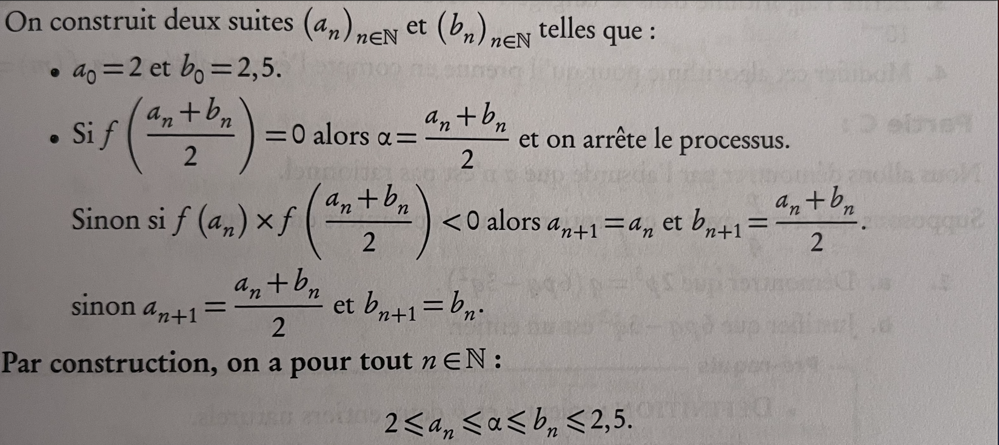

# Méthode par Dicthomie

## Partie 1

Voici une liste de valeurs, nous allons effecuter ce que l'on appelle une recherche par dicothomie d'une valeur spéciale dans la liste. 

Analysez l'algorithme de recherche par dicothomie ci-après et rechercher si la valeur 210 est dans la liste suivante.

```python
search = 210
l = [1,10,11,12,45,89,100,120,123,145,200,210,247,250,300,458,510,520]
```

```text

Voici l'algorithme de recherche par dicothomie

//déclarations
 début, fin, val, mil, N : Entiers
 t : Tableau [0..N] d'entiers classé
 trouvé : Booléen
 
//initialisation
 début ← 0 
 fin ← N
 trouvé ← faux
 Saisir val

//Boucle de recherche
 // La condition début inférieur ou égal à fin permet d'éviter de faire
 // une boucle infinie si 'val' n'existe pas dans le tableau.
  Tant que trouvé != vrai et début <= fin:
      mil ← partie_entière((début + fin)/2)
      si t[mil] == val:
         trouvé ← vrai
      sinon:
         si val > t[mil]:
            début ← mil+1
         sinon:
            fin ← mil-1
 //Affichage du résultat
  Si trouvé == vrai:
      Afficher "La valeur ", val , " est au rang ", mil
  Sinon:
      Afficher "La valeur ", val , " n'est pas dans le tableau"
```

## Partie 2 analyse de données

Une problématique lié au flottants est sa représentation finie (...) dans machine. Si on fait la somme suivante on s'attend précisémment à avoir 1, mais ce n'est pas le cas :

```python
s = 0
for _ in range(10):
    s += 0.1

print(s)
# 0.9999999999999999
```

Pour remédier à ce problème en Python nous pouvons utiliser le module Decimal, dans ce cas Python aura, en précisant le nombre de décimales que l'on souhaite avoir dans nos calculs.

```python
from Decimal import *
getcontext().prec = 6 # précise le nombre de décimal que l'on souhaite avoir dans nos calculs.
s = 0
for _ in range(10):
    s += Decimal(0.1)

print(s)
# Decimal('1.00000')
```

Rappel de la méthode, on suppose que l'on a une fonction f continue (et dérivable) sur un intervalle fermé de réels :

```python
I = [2, 2.5]
```

   

Soit maintenant le problème suivant, nous supposerons que la fonction f suivante est définie sur l'intervalle de valeurs réels 1 et 2. Nous souhaitons donner une valeur approchée de la racine carré de 2. Utilisez le théorème précédent et analyser en augmentant la précision dans l'algorithme le nombre de décimales que l'on peut obtenir, vous comparerez votre analyse à la valeur "théorique suivante" :

```python
from decimal import *
getcontext().prec = 100

print(Decimal('2').sqrt())
"""
1.414213562373095048801688724209698078569671875376948073176679737990732478462107038850387534327641573
"""
```

## Partie 3 analyse 

Analysez la complexité de ces algorithmes en comptant le nombre d'étapes et le temps d'exécution.

Pour le temps d'exécution vous devez utiliser le module timeit qui mesure le temps d'exécution en seconde.  

```python
import timeit
def test(n):
    divis = False
    for k in range(n):
        if k*7 == n:
            divis = True
        
    return divis
# On passe en premier argument le nom de la fonction avec une valeur pour n, on est obligé de faire le setup, puis on donne le nombre de fois que l'on souhaite exécuter la fonction.
timeit.timeit("test(1000)", setup="from __main__ import test", number=1)

# Donne environ sur ma machine 8.977800007414771e-05
timeit.timeit("test(1000)", setup="from __main__ import test", number=100000)
```