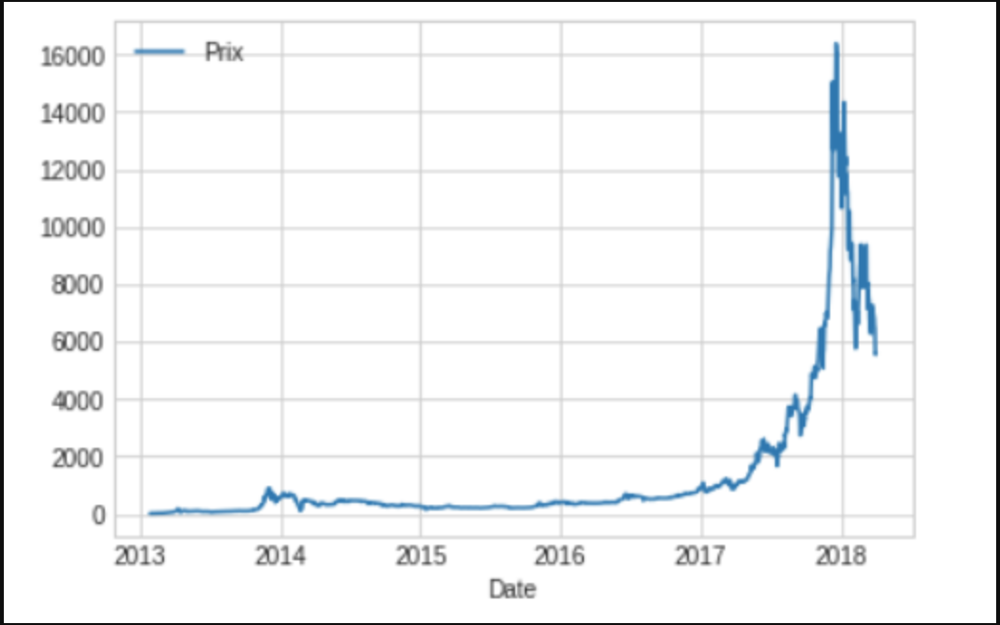

# Bitcoin

Récupérez les sources sur le serveur.

Affichez les données :

bitcoins =pd.read_csv('data/Cours_BTC.csv')
bitcoins.head()

1. Nettoyer la colonne Prix pour avoir cette colonne dans le type flaot.

2. Représentez graphiquement le cours du Bitcoin.

