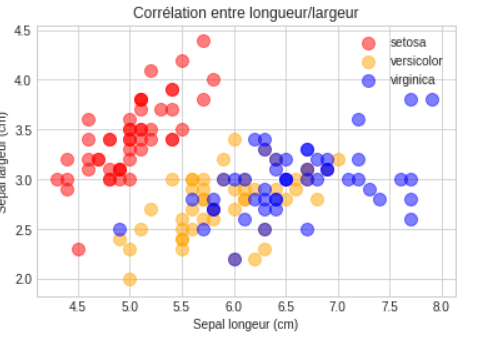

# Représenter un problème


## Diagramme à moustache (rappels)

Le diagramme à moustache résume quelques indicateurs de position d'un caractère étudié :

- Premier quantile 25%. Q1
- Médiane.
- Troisième quantile 75%. Q3
- Minimum.
- Maximun.

L'interquartile :

```python
IQ = Q3 - Q1
```

Ce diagramme est utilisé pour comparer un même caractère dans deux populations de tailles éventuellement différentes.

Propriétés du diagramme :

- Dans la boîte on a 50% des données.
- La longueur des moustaches est de 1.5 fois l'intervalle interquartile

Dans Matplotlib vous utiliserez la méthode : **boxplot**.

## Introduction aux données Iris

La représentation des données est très importante. John Snow un médecin du 19 ème sciècle a représenté sur une carte les morts dûs à une épidémie de choléra à Londre en 1854, il a également associé à cette carte les pompes à eau et a montré que l'épidémie venait de l'une d'entre elle.

## 02 Exercice Le problème des filles dans une famille de deux enfants

Considérons une famille avec deux enfants. Chaque enfant a autant de chance d’être une fille que d’être un garçon.

Le sexe du deuxième enfant est indépendant du sexe du premier.

1. L’enfant aîné est une fille. Quelle est la probabilité que les deux
enfants soient des filles ?

2. Au moins l’un des deux est une fille. Quelle est la probabilité que
les deux enfants soient des filles ?

Calculez ces probabilités de manière classique dans un premier temps. Puis simulez les deux questions en utilisant Numpy et matplotlib afin de confirmer l'approche théorique de ces deux questions à l'aide d'un graphique.

## 03 Exercice Les iris

Les données utilisées ici sont célèbres. Elles ont été collectées par Edgar Anderson. Ce sont les mesures en centimètres des variables suivantes : longueur du sépale (sepal length), largeur du sépale (sepal width), longueur du pétale (petal length) et largeur du pétale (petal width) pour trois espèces d'iris : **Iris setosa**, **I. versicolor** et **I. virginica**.

Sir R.A. Fisher a utilisé ces données pour construire des combinaisons linéaires des variables permettant de séparer au mieux les trois espèces d'iris.

Ce dataset est présent dans **skearn** (module de Data Analyst).

```python
import pandas as pd
import numpy as np
# On récupère uniquement le dataset iris
from sklearn.datasets import load_iris
# C'est un dictionnaire
iris = load_iris()

# Les clés du dictionnaires
iris.keys()
```

Nous allons essayer de visualiser une corrélation entre la longueur et la largeur des sépales des trois espèces d'iris. Utilisez un DataFrame Pandas pour faire cette représentation graphique.

Vous ferez un deuxième graphique par rapport aux pétales pour voir si il y a également une corrélation.

Pour les sépales on doit avoir un graphique comme suit :



### 04 Exercice nombre de but(s)

Voici un tableau présentant le nombre de matchs ayant gagné un certain nombre de buts pour une équipe donnée :

| nombre buts | 0  |  1  | 2  | 3  | 4  | 5 | 6 | 7 |
|-------------|----|-----|--- |----|----|---|---|---|
| nombre match| 7  | 17  | 13 | 14 | 8  | 6 | 0 | 1 |

Représentez ces données à l'aide d'un diagramme en moustache. En utilisant ce diagramme essayez d'interpréter les données.

### 05 Exercice naissance

Récupérez le dataset suivant : [base comparateur de territoires](https://www.insee.fr/fr/statistiques/2521169#consulter)

1. Faites une représentation en box-plot du nombre de naissances par habitant en fonction du département en Île-de-France en dehors de Paris. Et interprétez les données.
